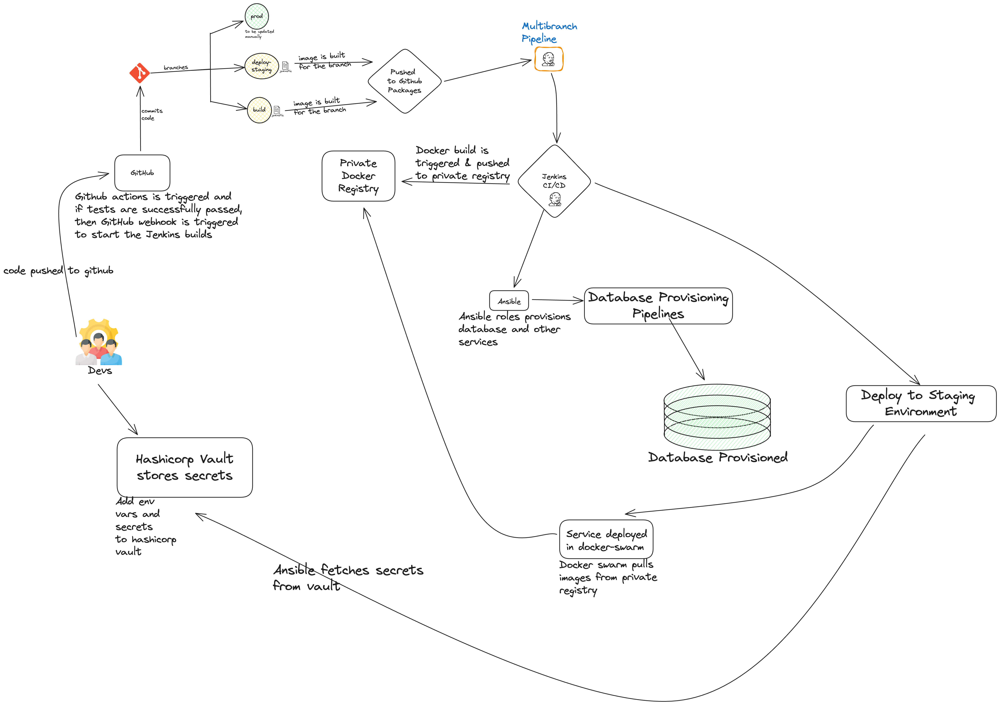

import DocsCard from '@components/global/DocsCard';
import DocsCards from '@components/global/DocsCards';

<head>
  <title>Welcome to the Samagra DevOps guide!</title>
  <meta
    name="description"
    content="your meta description"
  />
  <link rel="rel" href="href" />

  <meta property="og:url" content="https://docs-template-main.vercel.app" />
</head>

<intro-end />

<DocsCards>
  <DocsCard header="Installation Guide" href="/intro/cli" icon="/icons/guide-installation-icon.svg" hoverIcon="/icons/guide-installation-icon-hover.svg">
    
Step-by-step guides to setting up your server and installing the frameworks.

  </DocsCard>

</DocsCards>

## Overview

Whether you're a startup or a large enterprise, your ability to deliver software quickly, reliably, and securely is critical to your success. That's where DevOps comes in.

DevOps is a set of practices that combines development and operations teams to work together in a more agile, collaborative, and automated way.

At Samagra, we're passionate about adopting DevOps practices and improve the software delivery capabilities. In this guide, we'll explore the key concepts, tools, and processes that make up a successful DevOps strategy. Whether you're just getting started with DevOps or looking to improve your existing practices, this guide will provide practical tips and best practices to help you achieve your goals.

Let's get started with the guide.

## Appflow

## License

MIT License
