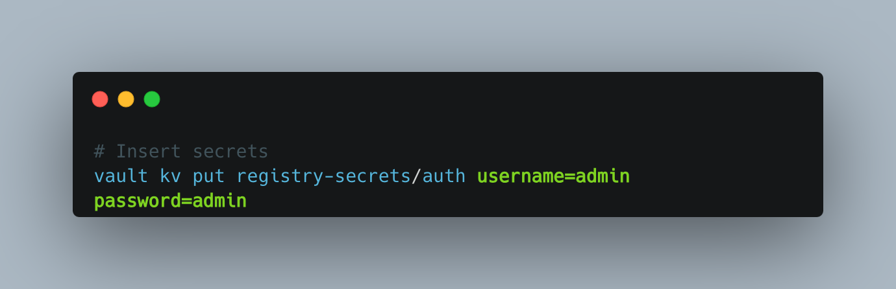

<head>
  <title>Environment Setup</title>
  <meta
    name="description"
    content="To get started with DevOps pipeline just run the scripts for installing the dependencies"
  />
</head>

To get started with setting up the DevOps Pipeline.

## Pre-requisites:
- Jenkins Server for running pipelines
- Hashicorp Vault for storing secrets
- Docker Swarm (This could be your localhost as well)
- Private Docker Registry
- Ansible for deploying swarm nodes

## Setting up the Pipeline
- ### **Clone the repository**
```
git clone https://github.com/SamagraX-RCW/devops.git
```


- ### **Run the scripts to install Docker, docker-compose & Ansible** 
```
chmod +x setup.sh
./setup.sh
```
<!-- - Get your SSL key from CA(Certified Authority) and paste it inside the ssl certificate(docker-registry.crt) -->

- ### **Now run the compose file to deploy Jenkins, registry & vault** 
```
docker compose up -d
```

- ### **Configure Vault token**
  - **Run the Script for configuring the Vault token**
    ```
    chmod +x ./scripts/set_env.sh
    ./scripts/set_env.sh
    ```

  - **Configure the script if you want to change the registry** username/password

  

  ***Note: This is store the registry username & password inside the vault***

  - **Save the inital root token & unseal keys **Securely** for future use-cases**

  - *Note:This script will keep the environment variable of Registry Username & Password inside the Jenkins container*
  

- ### **Configure Jenkins Credentials for Private Registry**
  **Go to** 

  Dashboard > RCW > deploy-staging > Credentials > docker-server > Update with **https://nginx-reverse-proxy:80 -u <registry_username> -p <registry_password>**, use port 443 if you are using SSL


- ### **SSL Configuration for Nginx**(Optional)
  - **Copy the SSL certificates and paste it inside the *nginx_config/ssl* folder**

  - **Now run the script**
    ```
    chmod +x ./scripts/set_up_ssl.sh
    ./scripts/set_up_ssl.sh
    ```
  
  - ***This script will store the ssl certs content inside the Vault as KV(key value) and keep as environment variable inside the Nginx container***

- ### **Deploy Swarm and other Services**
  - **Copy the hostname and paste in inside the inventory/hosts folder**

  - **Copy this command the paste this inside the script section inside the jenkins job**

  ```
  ansible-playbook -i ./ansible_workspace_dir/inventory/hosts ./ansible_workspace_dir/main.yml
  ```

  - **Now Jenkins will run ansible playbook after the build has been successful**


## Adding Ansible Roles for Services

- ### **Run the Script**

```
chmod +x /scripts/roles.sh
./scripts/roles.sh
```

- **Give the name of the role**

    eg. monitoring


- **Now give the variables for that role**

    eg. no. of replicas : 1/2/3