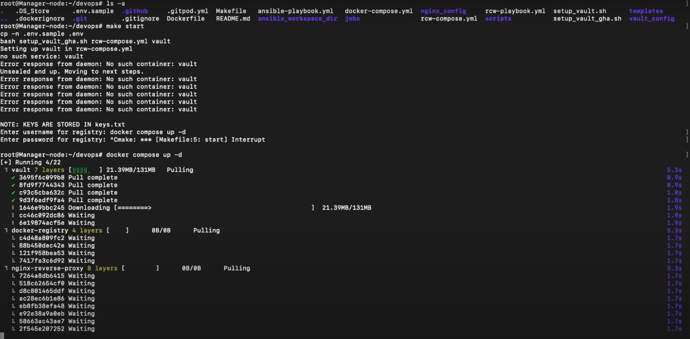

<head>
  <title>Environment Setup</title>
  <meta
    name="description"
    content="Here we'll deploy our pipeline in the Docker Container"
  />
</head>

Here we'll deploy our pipeline in the Docker Container using compose.

## Pre-requisites:
- Docker and Docker Swarm for running the compose services
- Make cli for running Makefile

## Setting up the Pipeline
- ### **Clone the repository**
```
git clone https://github.com/SamagraX-RCW/devops.git
```

- ### **Run the scripts to install Docker and Docker Compose** 
```
chmod +x ./scripts/setup.sh
./scripts/setup.sh
```

- ### **Now run the compose file to deploy Registry, Nginx and Vault** 
```
docker compose up -d
```



- ### **Start RCW Services**
```
make start
```
