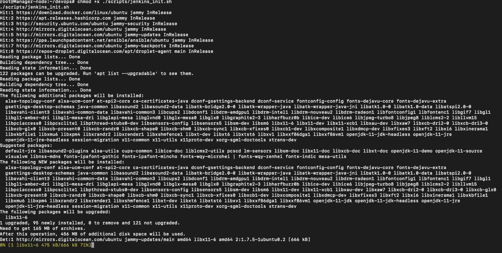
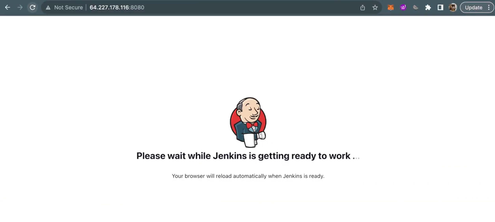
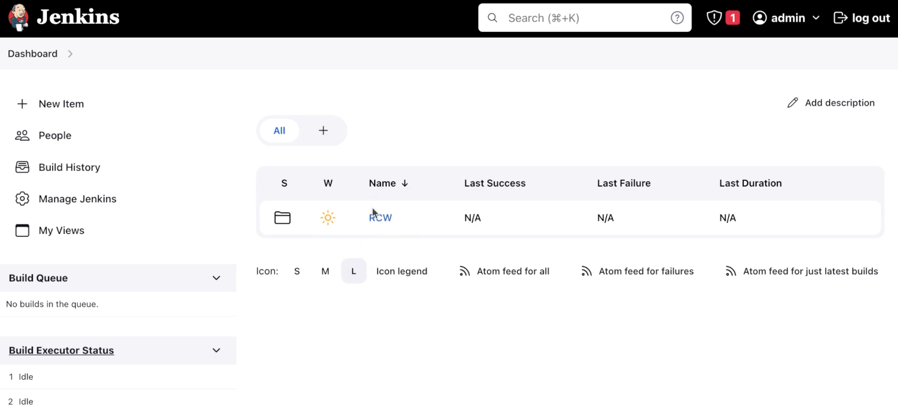
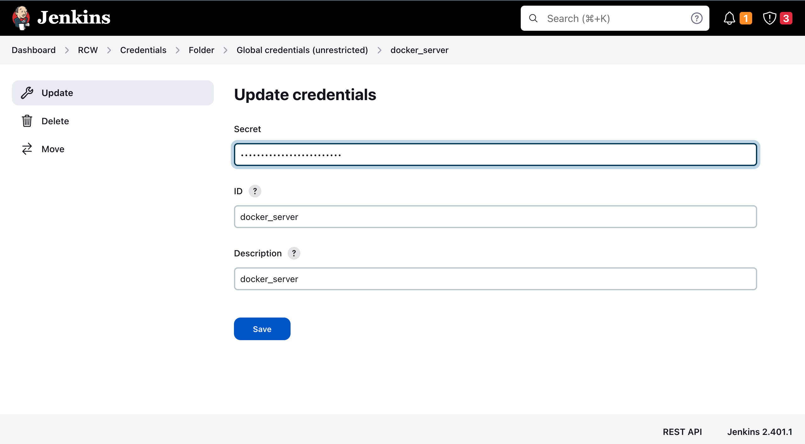

<head>
  <title>Environment Setup</title>
  <meta
    name="description"
    content="Here we'll deploy our pipeline in the Docker Container"
  />
</head>

Here we'll deploy our pipeline in the Docker Container using compose.

## Pre-requisites:
- Jenkins Server for running pipelines
- Hashicorp Vault for storing secrets
- Docker Swarm (This could be your localhost as well)
- Private Docker Registry
- Ansible for deploying swarm nodes

## Setting up the Pipeline
- ### **Clone the repository**
```
git clone https://github.com/SamagraX-RCW/devops.git
```


- ### **Run the scripts to install Docker Ansible and Vault Cli** 
```
chmod +x ./scripts/setup.sh
./scripts/setup.sh
```
<!-- - Get your SSL key from CA(Certified Authority) and paste it inside the ssl certificate(docker-registry.crt) -->

- ### **Install and Start Jenkins Service**
```
chmod +x ./scripts/jenkins_init.sh
./scripts/jenkins_init.sh
```



- ### **Install recommended plugins and restart Jenkins**
```
sudo systemctl restart jenkins
```





- ### **Configure Jenkins Credentials for Private Registry**
    - #### **Update the Registry Credentials in Jenkins:** 

        **Dashboard > RCW > deploy-staging > Credentials > docker-server**
        
        Update with **http://localhost:80**, also create new credentials for registry username and password**




- ### **Now run the compose file to deploy Registry, Nginx and Vault** 
```
docker compose up -d
```


- ### **Start RCW Services**

  - **Run the script to init the vault & generate unseal tokens**
  ```
  make start
  ```

  ***Note: This will store the registry username & password (admin/admin) inside the vault***

  - **Run the script to get registry username and password from vault**

  ```
  chmod +x ./scripts/get_secrets.sh
  ./scripts/get_secrets.sh
  ```


- ### **SSL Configuration for Nginx**(Optional)
  - **Copy the SSL certificates and paste it inside the *nginx_config/ssl* folder**

  - **Now run the script**
    ```
    chmod +x ./scripts/set_up_ssl.sh
    ./scripts/set_up_ssl.sh
    ```
  
  - ***This script will store the ssl certs content inside the Vault as KV(key value) and keep as environment variable inside the Nginx container***

## Adding Ansible Roles for Services

- ### **Run the Script**

```
chmod +x /scripts/roles.sh
./scripts/roles.sh
```

- **Give the name of the role**

    eg. monitoring


- **Now give the variables for that role**

    eg. no. of replicas : 1/2/
