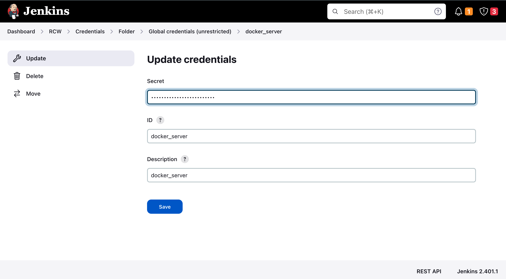

<head>
  <title>Environment Setup</title>
  <meta
    name="description"
    content="Here we'll deploy our pipeline in the Docker Container"
  />
</head>

To get started with setting up the DevOps Pipeline.

## Pre-requisites:
- Jenkins Server for running pipelines
- Hashicorp Vault for storing secrets
- Private Docker Registry
- Ansible for deploying swarm nodes

## Setting up the Pipeline
- ### **Clone the repository**
```
git clone https://github.com/SamagraX-RCW/devops.git
```

- ### **Run the scripts to install Docker, Ansible and Vault Cli** 
```
chmod +x ./scripts/setup.sh
./scripts/setup.sh
```
<!-- - Get your SSL key from CA(Certified Authority) and paste it inside the ssl certificate(docker-registry.crt) -->

- ### **Install and Start Jenkins, Vault, Registry Services**
```
chmod +x ./scripts/scripts/jenkins_init.sh
chmod +x ./scripts/install_jenkins_vault_registry.sh

./scripts/jenkins_init.sh
./scripts/install_jenkins_vault_registry.sh
```


- #### *Restart Jenkins to load the RCW jobs*
```
systemctl restart jenkins
```


- ### **Configure Jenkins Credentials for Private Registry**
    - #### **Update the Registry Credentials in Jenkins:** 

        **Dashboard > RCW > deploy-staging > Credentials > docker-server**
        
        Update with **https://nginx-reverse-proxy:80**, also create new credentials for registry username and password
        

        

    - #### **Update the job credentials for ansible deployment**

        **Dashboard > RCW > deploy-staging > credentials/identity/schema > configure**
      
      

    - #### **Add Vault Server Address and Token Secret**

      **Dashboard > Manage Jenkins > System > System > Environment Variables**

      *Add VAULT_TOKEN and VAULT_ADDR*
    
    

- ### **Create Swarm nodes and deploy RCW Services**
```
ansible-playbook -i ./ansible_workspace_dir/inventory/hosts ./ansible_workspace_dir/main.yml 
```


- ### **Configure Vault**

  - **Run the makefile to init the vault & generate unseal tokens**
  ```
  chmod +x setup_vault.sh
  ./setup_vault.sh
  ```

  ***Note: This will store the registry username & password (admin/admin) inside the vault***

  - **Run the script to get registry username and password from vault**

  ```
  chmod +x ./scripts/get_secrets.sh
  ./scripts/get_secrets.sh
  ```